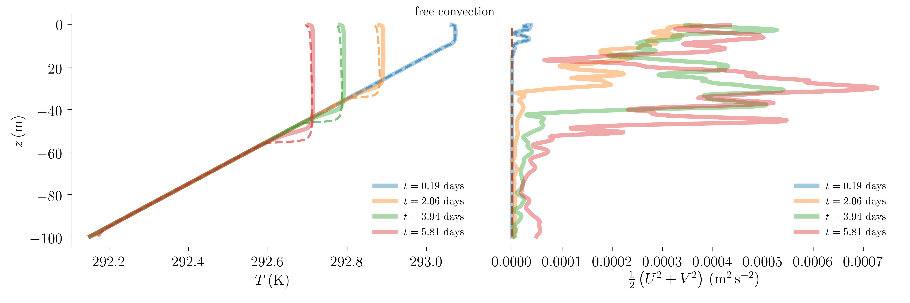
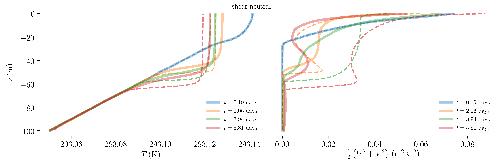

# An ocean column model optimzation project

We are using Bayesian techniques to evaluate and optimize column models for the turbulent ocean surface boundary layer.

Our framework permits an 'apples-to-apples' comparison of turbulence closures (aka, 'parameterizations') 
optimized or tuned to the same data set and solved with identical numerical methods.
For this project, we focus on optimizing column models --- one-dimensional idealizations of
incompressible, rotating, stratified Boussinesq turbulence in horizontal-periodic domains driven by surface fluxes in ocean-relevant physical regimes --- to match idealized data sets generated by high-resolution large eddy simulations.

An example of the kind of simulation data we will use to optimze column models is shown below.
This example was generating by imposing both a momentum flux and a destabilizing buoyancy flux
at the top of the domain to a fluid initialized at rest with a linear temperature stratification.

An example comparison between large eddy simulation and the solution to [`OceanTurb.jl`]'s one-dimensional implementation of
the K-profile-parameterization of Large et al. (1994) is shown below.

This project is part of the Climate Modeling Alliance.
